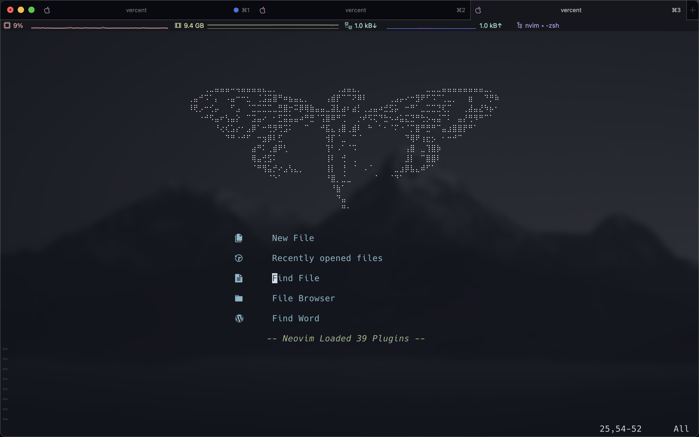
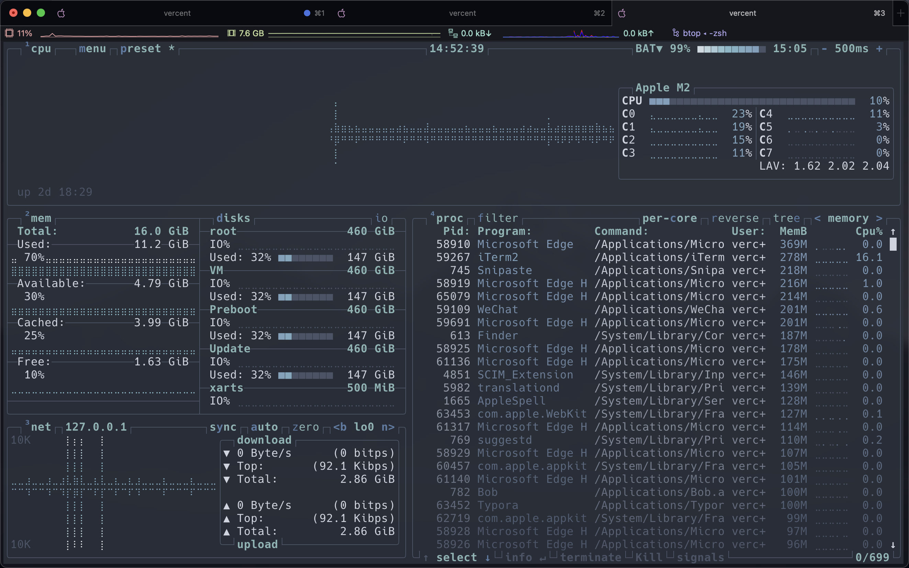
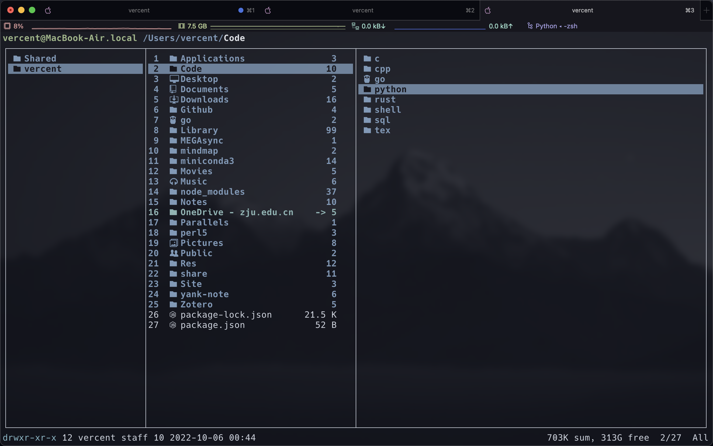

<!--slides 1-->

**朋辈辅学 技能拾遗**

Before the course begin —— 课程前瞻

Given by [Zicx](https://zicx.top/)

Powered by [reveal.js](https://github.com/hakimel/reveal.js)

Oct 14, Fri.

Note: Test note.

<!--s-->

## **Introduction**

<!--v-->

## **Course Syllabus**

<!--v-->

|    Date     |                 Content                 | Tutor |
| :---------: | :-------------------------------------: | :---: |
|    10.15    |              Git / Github               | Zicx  |
|    10.29    |                Markdown                 | Zicx  |
|    11.12    |                   Vim                   | Zicx  |
|    11.26    |            Terminal / Shell             | Zicx  |
|    12.10    |                  LaTeX                  | Zicx  |
|    12.24    |            GNU Make / Cmake             | Zicx  |
| 12.31 (TBD) | Apps & Tools recommendation && chatting | Zicx  |

<!--v-->

### **Why we offer this course?**

- [MIT 6.null](https://missing.csail.mit.edu/): The Missing Semester of Your CS Education
- Master some handy tools and utilities(Vim, Markdown, Shell etc.).
- Enhance your CS literacy or make you more professional.
- Get more interested in CS.
- ...

<!-- .element: class="fragment" -->

<!--v-->

### **How to learn this course ?**

- **Environment**
  - Linux/ Mac(Recommend)
  - WSL and Virtual Machine is also available.

<!-- .element: class="fragment" -->

- **Practice**
  - You will only learn if you do it by yourself.
  - RTFM —— "Read The Fucking Manual"
  - STFW —— "Search The Fucking Web"
    - Baidu / CSDN  :(
    - Google / StackOverflow  :)
    - [Github](https://github.com/) is more than you can imagine.

    Don't have a github account? Register now!

<!-- .element: class="fragment" -->

<!--s-->

## **Course Overview**

<!--v-->

**Git - Version control system**

lazygit

<!--v-->

**Github - Internet hosting platform**

<!--v-->

**Github - Internet hosting platform**

Welcome to visit my github page [https://github.com/Xuer04](https://github.com/Xuer04) :)

<!--v-->

**Vim - The best editor in the world**

Comparison of editor learning curves Source

<!--v-->

**Vim - The best editor in the world**

<!--v-->

**Vim - The best editor in the world**

<!--v-->

**Vim - The best editor in the world**

<!--v-->

**Vim - The best editor in the world**

<!--v-->

**Markdown - Focus on the content**

<!--v-->

**Markdown - Focus on the content**

<!--v-->

**LaTeX - A document preparation system**

<!--v-->

**LaTeX - A document preparation system**

<!--v-->

**Terminal - The hidden utility in your PC**

System Monitor

<!--v-->

**Terminal - The hidden utility in your PC**

File Manager

<!--v-->

**Terminal - The hidden utility in your PC**

Multi-tasking

<!--v-->

**GNU Make / Cmake - Manage your project**

<!--s-->

## **The end**

### Questions?
