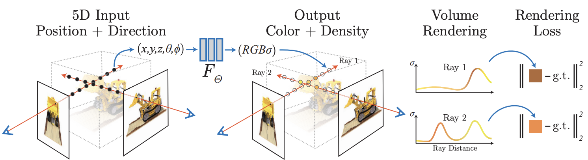
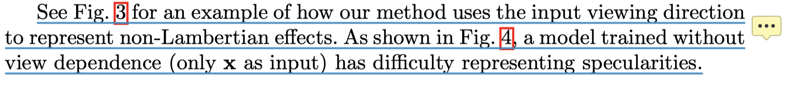
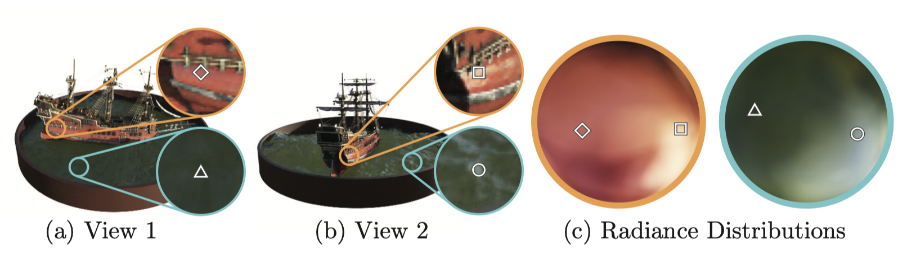
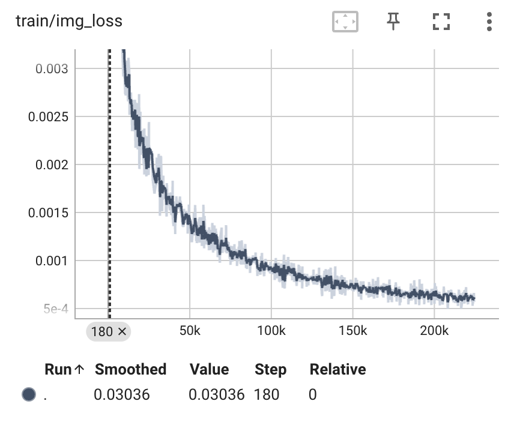
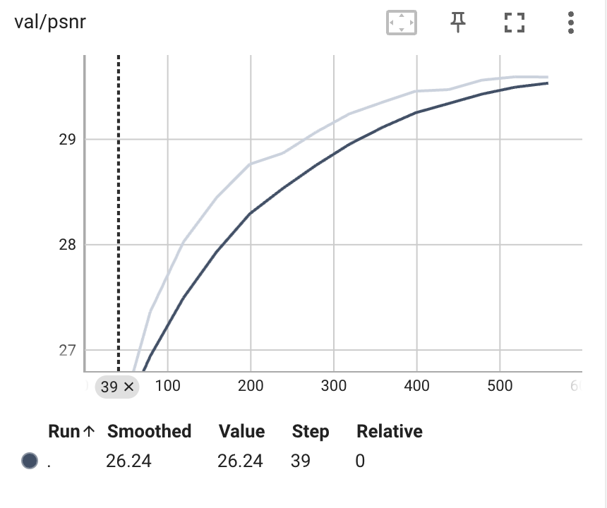

<div class="middle center" style="position: relative;">
  <div style="position: absolute; top: 0; right: 0; transform: translate(-10%, -10%);">
    
  </div>
  <div style="width: 90%; display: inline-block; vertical-align: top; transform: translate(8%, 10%);">
    <h1>Taichi 社区分享会</h1>
    <hr>
    <p>Exploring NeRF: My Journey Through Research and Code</p>
    <p>By <a href="https://github.com/Xuer04">@Chenxu Zhou</a></p>
    <div style="text-align: right; margin-top: 1em;">
      <p>2023.4.26</p>
      <p>Powered by <a href="https://github.com/webpro/reveal-md">@reveal-md</p>
    </div>
  </div>
</div>

<!--v-->

## About Me


Who am I?

- 浙江大学光电科学与工程系大三在读
- [ZJU 3DV Group](https://github.com/zju3dv) 实习生
- Vim 爱好者/开发者 &hairsp; ➡️  [My neovim config](https://github.com/Xuer04/Awesome-neovim)

Research interest

- 3D generation and reconstruction
- Volumetric video rendering
- Computer Graphics

Miscs

- Github: <https://github.com/Xuer04>
- Homepage: <https://zicx.top/>
- Twitter: <https://twitter.com/cxzhou35>

<!--v-->

## Table of Contents

本次分享会我会分享我学习 NeRF 的经验，以及如何学习和阅读论文与代码

<div class="fragment">

- NeRF 介绍

</div>

<div class="fragment">

- NeRF 论文阅读

</div>

<div class="fragment">

- NeRF 代码学习

</div>

<div class="fragment">

- 如何复现 NeRF

</div>

<div class="fragment">

相关资料的链接 🔗

- 论文阅读笔记: <http://zicx.top/notebook/paper/nerf/>
- 复现代码仓库: <https://github.com/Xuer04/learning_nerf>

</div>

<!--v-->

## Take Aways

<div class="fragment">

以下内容不是本次的重点

- NeRF 论文解读，原理解释 ❌
- 前沿的 NeRF 发展 ❌
- NeRF 代码讲解 ❌

</div>

<div class="fragment">

值得关注的是这些内容

- 如何系统地接触和学习项目 ✔️
- 如何高效地读论文 ✔️
- 如何阅读项目代码 ✔️

</div>

<!--s-->

<div class="middle center">
<div style="width: 100%">

# Part.1 NeRF 介绍

</div>
</div>

<!--v-->

## 什么是 NeRF？

NeRF 的全称是 *Neural radiance fields*，是一种利用神经网络从 2D 稀疏图像生成物体或场景的 3D 表示的技术

<div class="fragment">

传统的三维重建方法

- 主动式: 结构光重建、TOF方法、三角测距法
- 被动式: SfM、REMODE、SVO

</div>

<div class="fragment">

NeRF 相较于这些方法的优势

- 继承了体积表示的优点，可以表示复杂的几何形状和外观
- 适合使用投影图像进行基于梯度（可微）的优化
- 克服了在高分辨率建模复杂场景时，离散化体素网格带来的存储成本过高的问题

</div>

<!--v-->

## Pipeline

<div style="text-align: center;">
  
</div>

<br>

1. 输入一组稀疏图像，沿着相机光线的方向采样 5D 坐标
2. 将坐标信息输入到 MLP 中，生成 RGB 颜色和体积密度
3. 使用立体渲染的方法根据颜色和体积密度生成图像
4. 最小化合成图像和GT之间的残差来优化场景表示

<!--v-->

## NeRF 的结果

<div style="display: flex; justify-content: center; align-items: center; position: relative;">
  <div style="text-align: center;">
    
  </div>
  <div style="text-align: center;">
    
  </div>
</div>

<!--s-->

<div class="middle center">
<div style="width: 100%">

# Part.2 NeRF 论文阅读

</div>
</div>

<!--v-->

## 如何阅读一篇论文(一)

对于像我一样的入门学习者，提供一些我学习过程中的经验

在读论文之前，先梳理一个框架出来，大致包括以下内容：

- What: 这篇论文主要做的工作是什么，基于什么背景
- How: 这篇论文具体是怎么做的，一般都会有以下部分
  - Pipeline
  - Cutting-edge 的方法
  - Tricks & Optimizations
- Results: 这篇论文最后的结果如何，如何衡量效果
  - Experiments & Metrics & Demo
  - Benchmarks 的适用范围

可以用笔记或者思维导图的形式先梳理一个这样的 backbone，之后在阅读论文的过程中一点一点填进去

<!--v-->

## 以 NeRF 为例

我们以 NeRF 为例来使用一下这个框架

- What: <br> 通过稀疏的输入视图优化底层的的连续神经辐射场，实现复杂场景的新视角合成
- How:
  - Pipeline
  - Cutting-edge 的方法: 可微的隐式场景表示
  - Tricks & Optimizations
    - 位置编码(Positional encoding)
    - 分层采样(Hierarchical volume sampling)
- Results:
  - PSNR/SSIM/LPIPS/Demo(novel view)
  - Benchmarks 的适用范围： llff/blender/deepvoxels/LINEMOD

<!--v-->

## 如何阅读一篇论文(二)

关注论文中的图，论文中的图可以最直观的反映论文里提到的内容

<div style="text-align: center;">
  
</div>

<div style="text-align: center;">
  
  <p> Fig3 </p>
</div>

<!--v-->

## 如何阅读一篇论文(三)

关注论文中的公式，这有助于更好地理解算法原理，对于阅读源码也会有所帮助，建议自己手推一遍论文中的公式，相关参考资料可以从论文 reference 中收集

在 NeRF 的论文中，涉及到了以下几个公式

- 透射率
- 颜色积分
- 分段体积渲染
- NDC 坐标系转换

公式推导可以参考我的笔记 ➡️  [NeRF 公式推导](http://zicx.top/notebook/paper/nerf/math/)

<!--v-->

## 借助工具

以下工具可以帮助我们更高效地读取论文，非常值得尝试

<div class="fragment">

- [ChatPDF](https://www.chatpdf.com/): Chat with any PDF

</div>

<div class="fragment">

- [ChatGPT Academic](https://github.com/binary-husky/chatgpt_academic): 科研工作专用ChatGPT/GLM拓展

</div>

<div class="fragment">

- New Bing: 选择 Edge 浏览器为 PDF 文件打开方式，可以直接在页面上与 Bing chat 交互

</div>

<div class="fragment">
<div style="text-align: center;">
  
</div>
</div>

<!--s-->

<div class="middle center">
<div style="width: 100%">

# Part.3 NeRF 代码学习

</div>
</div>

<!--v-->

## 挑选合适的资源

NeRF 的代码实现有很多方式，可以从中选取比较熟悉的实现方式

- [官方的 TensorFlow 实现](https://github.com/bmild/nerf)
- [Pytorch 实现](https://github.com/yenchenlin/nerf-pytorch)
- [Read NeRF Pytorch](https://github.com/xunull/read-nerf-pytorch): 带注释版本的 nerf-pytorch
- [Taichi + PyTorch](https://github.com/taichi-dev/taichi-nerfs): Taichi + Pytorch 实现

建议学习 Pytorch 相关的实现方式，Pytorch 是现在更加主流的框架

<!--v-->

## 如何学习源码

推荐用**模块化**的方式来学习源码，边看源码的结构边**整理框架**<br>
CV/DL 相关的论文源码一般都会包括以下几部分

- Datasets
- Networks
- Evaluators
- Trainers
- Visualizers(optional)

对于 NeRF 而言，还会多一个模块: `Renderer`

读代码的过程中，也可以多做一些事情

- 顺手记录一下用到的**参数**，方便之后复现
- 对比论文中的一些算法和细节，弄清楚如何用代码实现的<br>
    (position encoding/volume rendering etc.)

<!--v-->

## 动手实践

一种比较高效的学习源码方式是看代码的同时自己跟着写，慢慢地完善代码的各个部分，最后完全实现

这个过程也有很多需要注意的地方:

- 自己写很难有和原作者不同的思路和框架，容易变成 C-c + C-v，因此推荐按照之前提到的框架来写
- 按照模块化的方式来检验自己写的代码能不能 work，一次性 debug 整个框架会很困难，debug的过程很<del>痛苦</del>快乐
- 学习了源码的实现方式后，提取实现过程中的**重点思想和方法**，然后尝试**不看源码**来实现自己的代码

> 后续介绍 NeRF 的复现时还会具体介绍这部分 :)

<!--s-->

<div class="middle center">
<div style="width: 100%">

# Part4. 如何复现 NeRF

</div>
</div>

<!--v-->

## 数据集准备

Pipeline

- 用手机拍摄一段目标物体的多视角视频
- 用 ffmpeg 对视频抽帧得到目标物体的多视角图像
- 借助 Colmap 标定，获得相机的内参和外参
- 整理数据格式，生成 NeRF 对应的数据集(推荐使用 Blender 格式)

数据集格式

```
.
├── train
│   ├── r_0.png
│   ├── r_1.png
│   └── ...
├── ...
└── transforms_train.json

```

<!--v-->

## 训练模型

数据集准备完，在之前自己实现的框架上训练模型，为了检验代码是否能 work，可以在训练的过程中关注一些量化的数据，借助 TensorBoard 我们可以可视化训练过程

<div style="display: flex; justify-content: space-between;">
  
  
</div>

<!--v-->

## Eval 结果

模型训练完之后，可以保存模型做 evaluate，通过 novel view 和 metrics 来检验训练结果(200k iterations)

<div style="display: flex; justify-content: center; align-items: center; position: relative;">
  <div style="text-align: center;">
    
  </div>
  <div style="text-align: center;">
    
  </div>
</div>

Metrics:

| MSE | PSNR |
|:--:|:--:|
|0.00124|29.13|

<!--v-->

## 一些 Tips

关于自己制作数据集，需要注意以下几点

- 拍摄场景的光照条件尽可能保持一致
- 尽量保持多视角物体在图像中的相对位置不变
- 为了获得更精确的相机内参，可以在用 COLMAP 的时候选择**共享内参**
- 多视角图像的数量保持在 50-100 张比较合适

训练过程中模型调参

- 先根据论文中的参数复现，遇到问题再检查各个模块
- 由于拍摄场景的不同，需要调整 scene 的 near 和 far 参数(原先 NeRF 中使用的是 2.0 和 6.0 )
- 关注训练过程中 loss 的变化，如果有问题的化可以考虑简化训练过程，只用 coarse model 进行训练，查看结果是否有问题，没问题再加上 fine model
- ...

<!--s-->

<div class="middle center">
<div style="width: 100%">

# Thanks

<hr/>

**Any Questions?**

</div>
</div>
